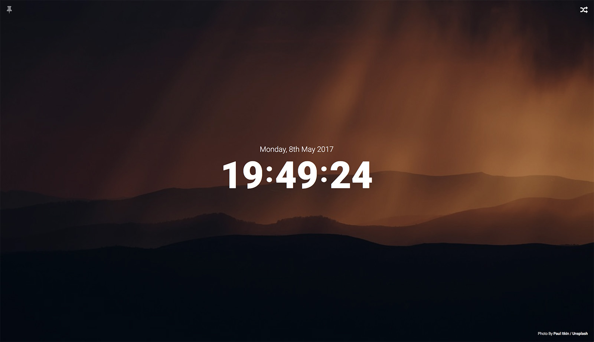
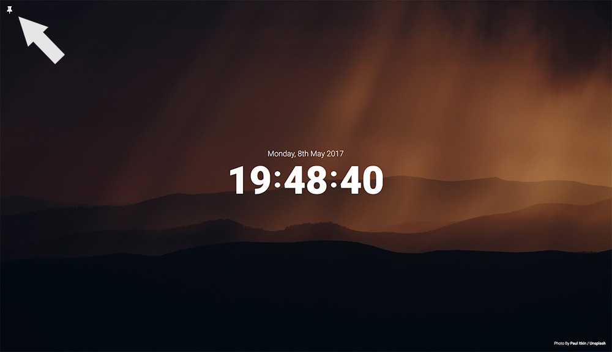
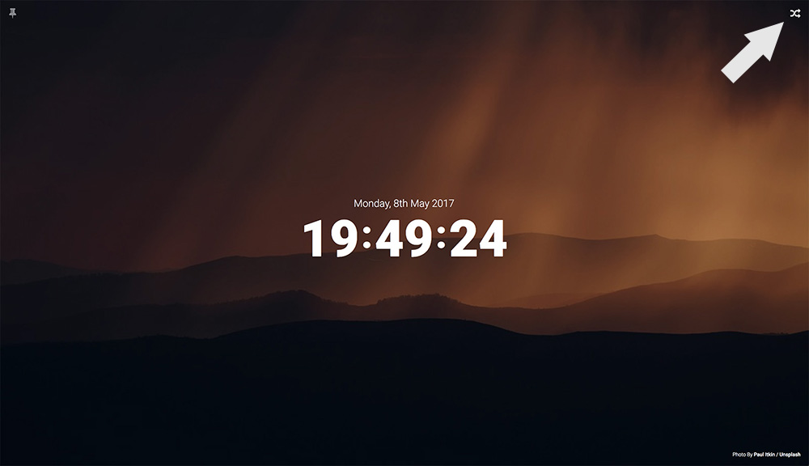

# Sploosh
Beautiful Unsplash photos for your new tab.



## Setup

You will need an Unsplash client id found here [https://unsplash.com/developers](https://unsplash.com/developers)

Update client_id in main.js:
  
```javascript
var client_id = '<CLIENT_ID_HERE>';
```

## Installation

To load Sploosh into Chrome go to Settings > Extensions

Turn on Developer Mode

Click load unpacked extension 

Choose the Sploosh folder and you're ready to go!

## How It Works

Every new tab loads a random Unsplash photo.

**Pin**



See an image you like?  
Click the pin icon to make it stick.

**New**



Want a new image without opening a new tab?  
Click the random icon or the spacebar on your keyboard.

## Copyright & License

Copyright (c) 2017 Conor Hughes - Released under the MIT license.